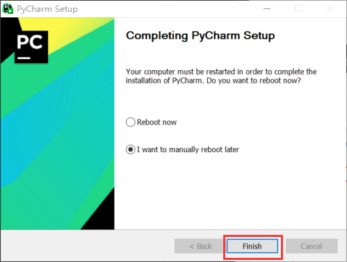
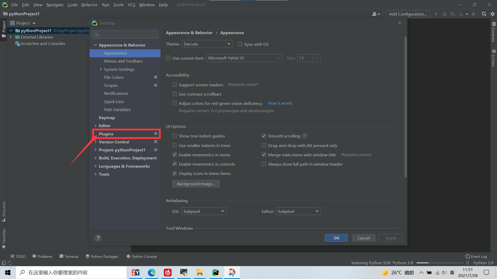
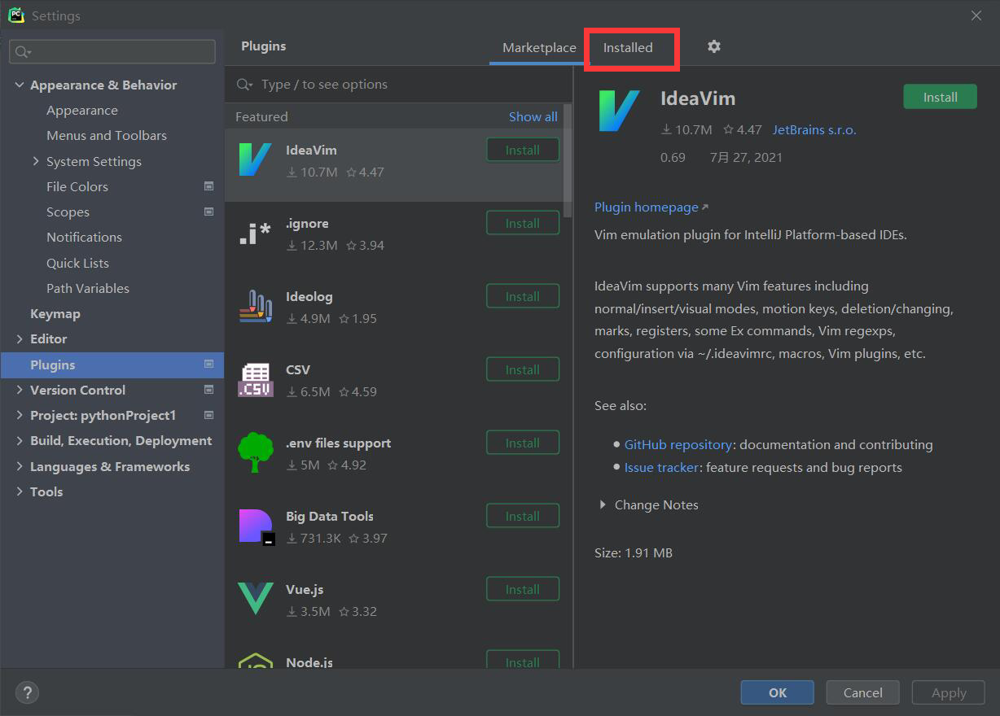
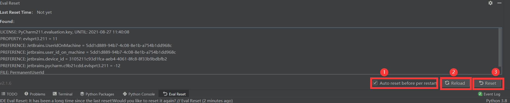
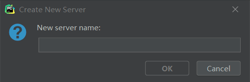
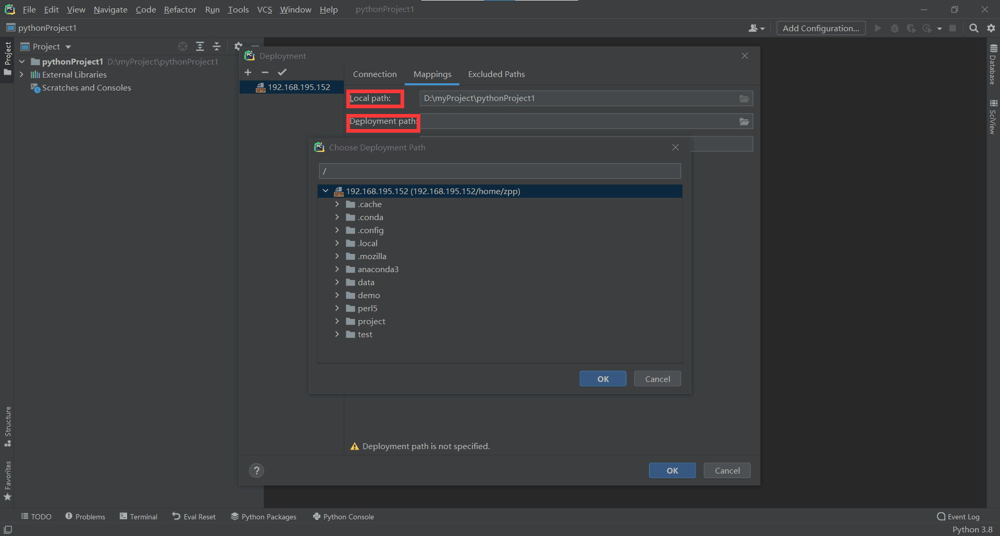

# pytharm-base-knowledge(**author——董新宇**)
# 下载与安装PyCharm
> ## 下载PyCharm
+ 前往[PyCharm官网](https://www.jetbrains.com/pycharm/)进行下载，点击 <kbd>Download</kbd>进行PyCharm下载，如图：  
 
+ 点击<kbd>Download</kbd>下载专业版PyCharm,只有专业版PyCharm拥有远程连接功能
 
>## 安装PyCharm
+ 下载完成后点击exe文件进行安装

+ 点击<kbd>next</kbd>进入下一步  

+ 在绿框处选择PyCharm程序的安装地址，也可以选择默认。选择完毕后点<kbd>next</kbd>进入下一步

+  **在界面中出现四个勾选框分别是**:  
1.创建一个桌面快捷方式  
2.将 **Open Folder as Project**添加到右键菜单  
3.将.py文件与PyCharm进行关联  
4.将启动器目录添加到**PATH**中  
建议全部勾选，然后点击<kbd>next</kbd>  

+ 命名编译器文件夹，命名完成后点击<kbd>Install</kbd>  

+ 安装完毕后选择重启或者稍后重启，然后点<kbd>Finish</kbd>完成安装  

***
***
***
# 破解专业版PyCharm
> ## 下载EvalResetter
+ EvalResetter通过重新设定免费日期来达到对IDE的无限期免费，想了解更多可以前往[项目地址](https://gitee.com/pengzhile/ide-eval-resetter),该项目现在已经对JetBrains全家桶可用。
+ 这里提供*ide-eval-resetter-2.1.6*百度网盘下载地址[百度网盘](https://pan.baidu.com/s/1vPvCuFUmFRC5CPiL6vPxMw)，提取码：**z0iv**
> ## 打开PyCharm
+ 打开PyCharm，勾选用户协议，点击<kbd>Continue</kbd>

+ 选择Evaluate for free进行免费试用，点击<kbd>Evaluate</kbd>

+ 可以看到30天免费的字样，点击<kbd>Continue</kbd>，进入PyCharm

> ## 新建项目
+ 点击<kbd>New Project</kbd>，创建新项目

+ 修改项目地址和项目名称，点击<kbd>Create</kbd>，创建新项目

+ 进入项目后按住<kbd>Ctrl</kbd>+<kbd>Alt</kbd>+<kbd>S</kbd>调出系统设置界面，选择**Plugins**  

+ 点击<kbd>Installed</kbd>，点击设置按钮，选择**Install Plugin from Disk**

+ 找到下载好的*ide-eval-resetter-2.1.6*，选择<kbd>OK</kbd>导入插件,导入后点击<kbd>Apply</kbd>和<kbd>OK</kbd>后插件安装完毕

+ 点击Help选择Eval Reset，勾选<kbd>Auto reset before per restart</kbd>,按照图片所标顺序点击按钮。会跳出提示框建议重启，选择<kbd>Yes</kbd>重启PyCharm便安装插件成功，打开Eval Reset可以看到激活时间发生了变化。

***
***
***
# 为PyCharm建立远程连接
> ## 进行远程环境部署
+ 点击Tools，选择Deployment中的configuration进入配置界面

+ 点击+后选择SFTP方式建立远程文件系统连接，自定义远程文件系统名称，完成后点击🆗

+ 点击<kbd>...</kbd>建立SSH连接，点击<kbd>+</kbd>,填写远程连接Host、Username、Password后点击Test Connection,测试连接成功后点击OK

+ 点击Autodetect找到远程连接用户名的首页，然后点击Mappings将本地文件目录与远程文件目录进行对应
1. Local Path是本地系统文件目录
2. Deployment Path是你项目代码存储的文件目录
需要将这两个目录对应起来，否则代码编译时会发生报错。找到远程服务器上的文件后点击ok保存。

+ 配置完成后点击Tools的Deployment的Browse Remote Host可以查看远程文件系统目录

+ 点击远程文件系统所在项目目录后，选择Tools->Deployment可以看到DownloadFromHere，点击即可从远程文件系统中下载所需代码到本地目录。

+ 已经将远程文件加载完成后，为了保持本地文件与远程文件的一致性，勾选Tools->Deployment->Automatic Upload

 
+ 如果要使用远程系统命令行点击Tools->Start SSH Seesion,点击需要远程服务器即可建立远程命令行
 
 
 
> ## 配置Python编译器
+ 按住<kbd>Ctrl</kbd>+<kbd>Alt</kbd>+<kbd>S</kbd>调出系统设置界面,点击Project->Python Interpreter修改Python编译器。
 
+ 点击设置按钮，选择Add添加远程服务器编译器，选择SSH Interperter,选择已有服务器配置。
 
 
 
+ 点击Next后选择Interpreter，其中Interpreter应为远程服务器端用户目录下anaconda中环境所拥有的python编译器，路径形式应为 /home/&&&/anaconda3/envs/###/bin/python@@@。其中&&&应为远端服务器用户名，###应为anaconda环境名，@@@应为python版本号。如果有sudo权限可以勾选Execute...。另外Sync floders中需要将本地项目目录与远程服务器项目目录相对应，这样可以使本地与远程的文件更改统一起来。确认所有选项即配置完成。
 
 
***
***
***
# 利用远程服务器编译代码
+ 选择编译器配置，点击Edit Configurations，选择远程服务器编译器，选择之后点击ok即可进行远程编译。

  
*author——董新宇*
